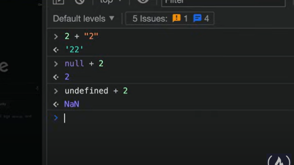

The quirkiy behavior of Js. 
It should not allow adding two different datatypes

The typeScript is all about Type Safety.

What TypeScript do is 'Static Checking' 

As you write the code it will check for language types and highlight the problematic area. this is not being done in javaScript unless you run the code in chrome or in a node environment. 

TypeScript is a development tool, your code still run in JS.


As you can see the email property is not present in object bt js still shows no error , on the other hand the TS is doing that. 

To Install the TypeScript Globally in your system use npm 

```markdown
npm i -g typescript
```


# Types In TypeScript 

There are many data types in typescript language. Some are :


The primitive Data Types are 

- Boolean
- Number
- String


# Syntax


defining all the types in lowercase.

# Function In TypeScript

we can degine the function in type script in a more safer format.
Like assigning data types to arguments that will be passed and assigning data types to the return type of a function , pretty cool right ? 

### See this as an example

#### Assigning Data Types to arguments and function itself


#### Assigning default values to arguments


